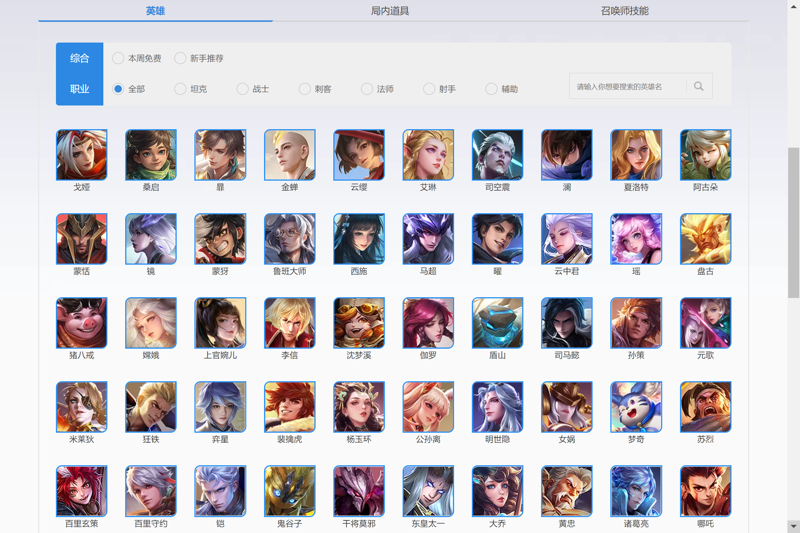
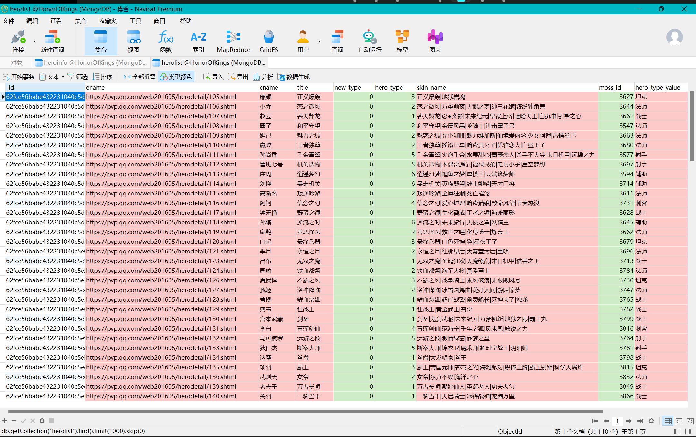
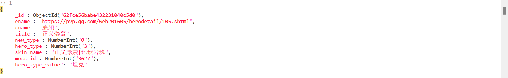
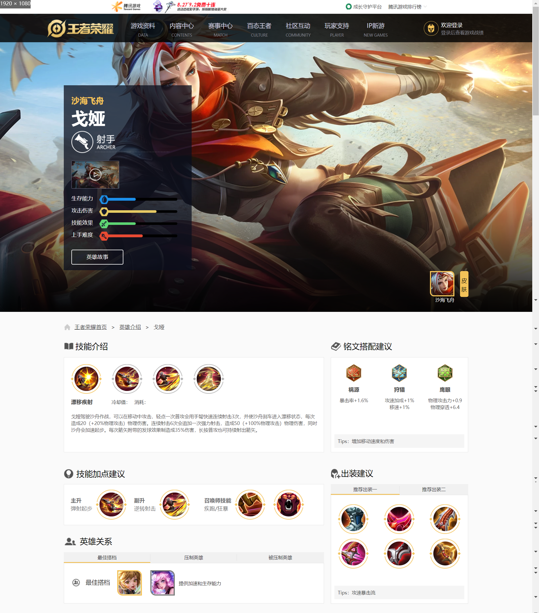
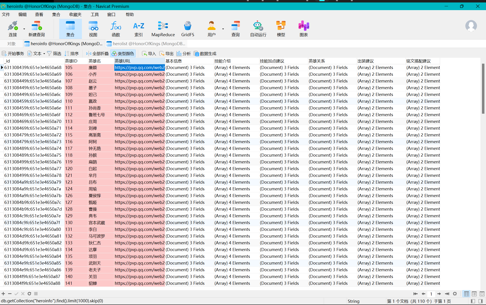

[toc]

## 零、说明

## 一、采集所有英雄的链接

#### （1）采集
```Python
import requests
res = requests.get('https://pvp.qq.com/web201605/js/herolist.json')
herolist_json = res.json()
hero_type_dict = {1:'战士', 2:'法师', 3:'坦克', 4:'刺客', 5:'射手', 6:'辅助'}
for k,v in hero_type_dict.items():
    for i in range(len(herolist_json)):
        if herolist_json[i]['hero_type'] == k:
            herolist_json[i]['ename'] = 'https://pvp.qq.com/web201605/herodetail/{}.shtml'.format(herolist_json[i]['ename'])
            herolist_json[i]['hero_type_value'] = v

# herolist_json[0]    # 数据展示
```

#### （2）入库

```Python
import pymongo
client = pymongo.MongoClient(host='localhost', port=27017)
db = client['HonorOfKings']     # 指定数据库
collection = db['herolist']     # 指定集合
collection.insert_many(herolist_json)   # 插入文档
```

## 二、采集所有英雄的详细信息

> 说明

1. **`lxml & XPath`** 采集的数据包括
 - 英雄基本信息
 - 技能介绍
 - 技能加点建议
 - 英雄关系

2. **`Selenium & XPath`** 采集的数据包括

    由于该部分内容被HTML注释，且`注释内容`与`页面展示（即肉眼所见内容）`不同，故采用 Selenium 方法采集
- 铭文搭配建议
- 出装建议

### 1、准备工作

#### （1）导库、读取所有英雄的URL链接

```Python
### 导库、读取数据库
### 导库、读取数据库
from pickletools import pynone
import re
import pymongo
import requests
from lxml import etree
from selenium import webdriver
from selenium.webdriver.common.by import By
from selenium.webdriver import ChromeOptions
from selenium.common.exceptions import NoSuchElementException

client = pymongo.MongoClient('mongodb://127.0.0.1:27017')
db = client['HonorOfKings']
collection = db['herolist']

results = collection.find({})
```

#### （2）英雄页面各个板块信息采集模块

- Lxml & XPath 方法采集得到的数据
<details><summary><font size="2" color="blue">点击查看折叠代码</font>
</summary>

<p>

```Python
### ✅英雄基本信息
### ✅技能介绍
### ✅技能加点建议
### ✅英雄关系

class LxmlMode:
    def __init__(self, url):
        res = requests.get(url)
        res.encoding = 'gbk'
        self.html = etree.HTML(res.text)

    ### ✅英雄基本信息
    '''
        返回一个字典
    '''
    def get_cover_info(self):
        # 英雄基本信息
        cover      = self.html.xpath('//div[@class="cover"]')[0]
        
        cover_name = cover.xpath('./h2/text()')[0]      # 英雄名
        herodetail_sort = cover.xpath('./span/i/@class')[0]     # 英雄类型
        cover_list = []

        cover_value = {
            '生存能力' : int(cover.xpath('.//ul/li[1]/span/i/@style')[0].split(':')[1][:-1]) / 100,
            '攻击伤害' : int(cover.xpath('.//ul/li[2]/span/i/@style')[0].split(':')[1][:-1]) / 100,
            '技能效果' : int(cover.xpath('.//ul/li[3]/span/i/@style')[0].split(':')[1][:-1]) / 100,
            '上手难度' : int(cover.xpath('.//ul/li[4]/span/i/@style')[0].split(':')[1][:-1]) / 100,
        }

        cover_info = {
            '英雄名称':cover_name, 
            '英雄类型':herodetail_sort[-1:], 
            '英雄基础信息':cover_value
            }
        
        return cover_info

    ### ✅技能介绍
    '''
        返回一个列表，列表内容包括每一个技能的介绍
    '''
    def get_skill_info_details(self):
        # 技能介绍
        skill_info = self.html.xpath('//div[contains(@class, "skill-show")]')[0]
        
        skill_info_details = []
        for div in skill_info.xpath('./div'):
            if len(div.xpath('./p[1]/b/text()')) == 0:
                pass
            else:
                skill_name = div.xpath('./p[1]/b/text()')[0]            # 技能名
                skill_time = div.xpath('./p[1]/span[1]/text()')[0][4:].split('/')  # 技能冷却值
                skill_need = div.xpath('./p[1]/span[2]/text()')[0][3:]  # 技能消耗
                skill_desc = div.xpath('./p[2]/text()')                 # 技能描述
                skill_info_details.append({
                    '技能名称' : skill_name,
                    '冷却时间（单位/秒）' : skill_time,
                    '消耗值' : skill_need,
                    '技能描述' : skill_desc,
                })

        return skill_info_details

    ### ✅技能加点建议
    '''
        返回一个字典
    '''
    def get_skill_upgrade_sugg(self):
        sugg_info2 = self.html.xpath('//div[contains(@class, "sugg-info2")]/p[contains(@class, "sugg-name")]')

        major_skill_sugg = sugg_info2[0].xpath('./span/text()')[0]
        minor_skill_sugg = sugg_info2[1].xpath('./span/text()')[0]
        hero_skill_sugg  = sugg_info2[2].xpath('./span/text()')[0].split('/')

        skill_upgrade_sugg = {
            '主升' : major_skill_sugg,
            '副升' : minor_skill_sugg,
            '召唤师技能' : hero_skill_sugg,
        }

        return skill_upgrade_sugg

    ### ✅英雄关系
    '''
        返回一个字典【多层】 
    '''
    def get_hero_relationship(self):
        hero_info_box = self.html.xpath('//div[@class="hero-info-box"]/div/div')

        def hero_info(xpath_):
            ids = [i.split('.')[0] for i in xpath_.xpath('./div[2]/ul/li/a/@href')]
            tips = xpath_.xpath('./div[3]/p/text()')
            
            relationship_dict = []
            for item in list(zip(ids, tips)):
                relationship_dict.append({
                    'id':item[0],
                    'tip':item[1]
                })
            return relationship_dict
        
        hero_relationship = {}
        for i in range(len(hero_info_box)):
            if i == 0:
                hero_relationship['最佳搭档'] = hero_info(xpath_=hero_info_box[i])
            elif i == 1:
                hero_relationship['压制英雄'] = hero_info(xpath_=hero_info_box[i])
            else:
                hero_relationship['被压制英雄'] = hero_info(xpath_=hero_info_box[i])
        
        return hero_relationship
```

</p></details>


- Selenium 方法采集得到的数据
<details><summary><font size="2" color="blue">点击查看折叠代码</font>
</summary>

<p>

```Python
### ✅出装建议
### ✅铭文搭配建议

class SeleniumMode:
    def __init__(self, url):
        option = ChromeOptions()
        option.add_argument('--headless')
        self.browser = webdriver.Chrome(options = option)
        self.browser.get(url)

    ## 出装建议【✅】
    '''
        返回一个元组，包含：
        1. (推荐出装一, Tips)
        2. (推荐出装二, Tips)
    '''
    def get_equip_sugg(self):
        equip_suggs  = self.browser.find_elements(By.CSS_SELECTOR, '.equip-bd > div')
        equip_1_info = []
        equip_2_info = []
        i = 0
        for equip_sugg in equip_suggs:
            i += 1
            tips = equip_sugg.find_element(By.XPATH, './p').text
            for equip in equip_sugg.find_elements(By.XPATH, './ul/li/a/div'):
                name       = equip.find_element(By.XPATH, './div[1]/div/h4').get_attribute('textContent')
                sale_price = int(equip.find_element(By.XPATH, './div[1]/div/p[1]').get_attribute('textContent')[3:])
                price      = int(equip.find_element(By.XPATH, './div[1]/div/p[2]').get_attribute('textContent')[3:])
                features   = equip.find_element(By.XPATH, './div[2]/p[1]').get_attribute('textContent')
                try:
                    desc       = equip.find_element(By.XPATH, './div[2]/p[2]').get_attribute('textContent')
                except NoSuchElementException:
                    desc       = None
                equip_info_dict = {
                    '装备名' : name,
                    '售价' : sale_price,
                    '总价' : price,
                    '特性' : features,
                    '描述/被动' : desc,
                }
                if i == 1:
                    equip_1_info.append(equip_info_dict)
                    equip_1_tips = tips
                else:
                    equip_2_info.append(equip_info_dict)
                    equip_2_tips = tips

        return ({'推荐出装一' : equip_1_info, '推荐出装建议' : equip_1_tips}, {'推荐出装二' : equip_2_info, '推荐出装建议' : equip_2_tips})

    ## 铭文搭配建议【✅】
    '''
        返回一个元组，包含：
        1. 铭文信息
        2. 铭文搭配Tips
    '''
    def get_ming_sugg(self):
        sugg_info = self.browser.find_element(By.CSS_SELECTOR, '.sugg-info.info')

        sugg_ming_tips = sugg_info.find_element(By.XPATH, './p').text
        lis = sugg_info.find_elements(By.XPATH, './ul/li')
        sugg_ming = []
        for li in lis:
            name = li.find_element(By.XPATH, './p[1]/em').text

            try:
                physical_attack = li.find_element(By.XPATH, './p[2]').text
                physical_penetration = li.find_element(By.XPATH, './p[3]').text
            except NoSuchElementException:
                physical_penetration = None
            ming_sugg_dict = {
                '铭文名称' : name,
                '属性一' : physical_attack,
                '属性二' : physical_penetration,
            }
            sugg_ming.append(ming_sugg_dict)
        
        return (sugg_ming, sugg_ming_tips)
```

</p></details>


### 2、正式采集 & 入库

#### （1）第一部分：Lxml & 入库

<details><summary><font size="2" color="blue">点击查看折叠代码</font>
</summary><p>

```Python
### 遍历每一个英雄的 URL
import pymongo
client = pymongo.MongoClient(host='localhost', port=27017)
db = client['HonorOfKings']
collection_list = db['herolist']    # 从该集合中读取英雄url进而采集每个英雄的信息
collection_info = db['heroinfo']    # 采集到的每个英雄的信息存入此集合

i = 0
results = collection_list.find({})
for result in results:
    i += 1
    # print('正在采集：【第{}个】'.format(i))
    name = result['cname']
    url = result['ename']
    id = url.split('/')[-1].split('.')[0]

    info1 = LxmlMode(url).get_cover_info()          # ✅英雄基本信息
    info2 = LxmlMode(url).get_skill_info_details()  # ✅技能介绍
    info3 = LxmlMode(url).get_skill_upgrade_sugg()  # ✅技能加点建议
    info4 = LxmlMode(url).get_hero_relationship()   # ✅英雄关系

    collection_info.insert_one({
        '英雄ID' : id,
        '英雄名' : name,
        '英雄URL' : url,
        '基本信息' : info1,
        '技能介绍' : info2,
        '技能加点建议' : info3,
        '英雄关系' : info4,
    })
```

</p></details>


#### （2）第二部分：Selenium & 入库

<details><summary><font size="2" color="blue">点击查看折叠代码</font>
</summary><p>

```Python
### 新增两列 字段，初试值为空
import pymongo
client = pymongo.MongoClient(host='localhost', port=27017)
db = client['HonorOfKings']
collection = db['heroinfo']

collection.update_many({'出装建议':{"$exists":False}}, {'$set':{'出装建议':None}})
collection.update_many({'铭文搭配建议':{"$exists":False}}, {'$set':{'TEST2':None}})

### 遍历每一个英雄的 URL，采集数据
import pymongo
client = pymongo.MongoClient(host='localhost', port=27017)
db = client['HonorOfKings']
collection_info = db['heroinfo']

i = 0
results = collection_info.find({})
for result in results:
    url = result['英雄URL']
    id = url.split('/')[-1].split('.')[0]
    print('【英雄ID】', id)

    info5 = SeleniumMode(url).get_equip_sugg()      # ✅出装建议
    info6 = SeleniumMode(url).get_ming_sugg()       # ✅铭文搭配建议

    collection_info.update_one(
        {"英雄ID":id},                  # 条件
        {"$set":{                       # 更新 数据
            "出装建议":info5, 
            "铭文搭配建议":info6
            }
        }
    )
```

</p></details>

## 三、数据展示

- 所有英雄基本信息（即：从下图中获取到的所有英雄的信息）

<div align=center>
  

  
</div>

- 所有英雄各模块的详细信息（如下图）

<div align=center>
  
  
</div>


## 四、代码

- [王者荣耀v1.0_220903.ipynb](%E7%8E%8B%E8%80%85%E8%8D%A3%E8%80%80v1.0_220903.ipynb)