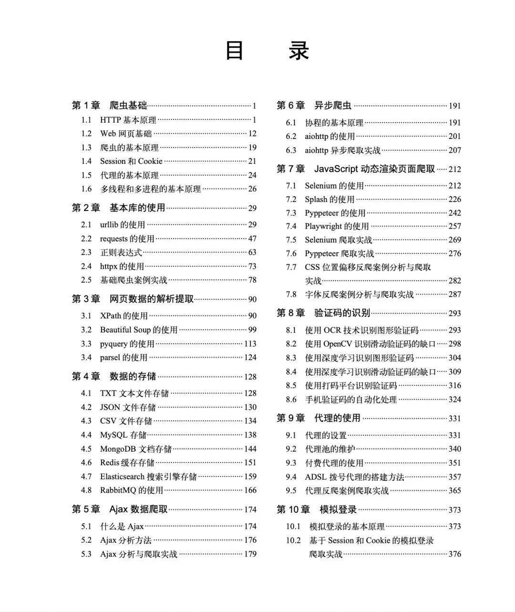
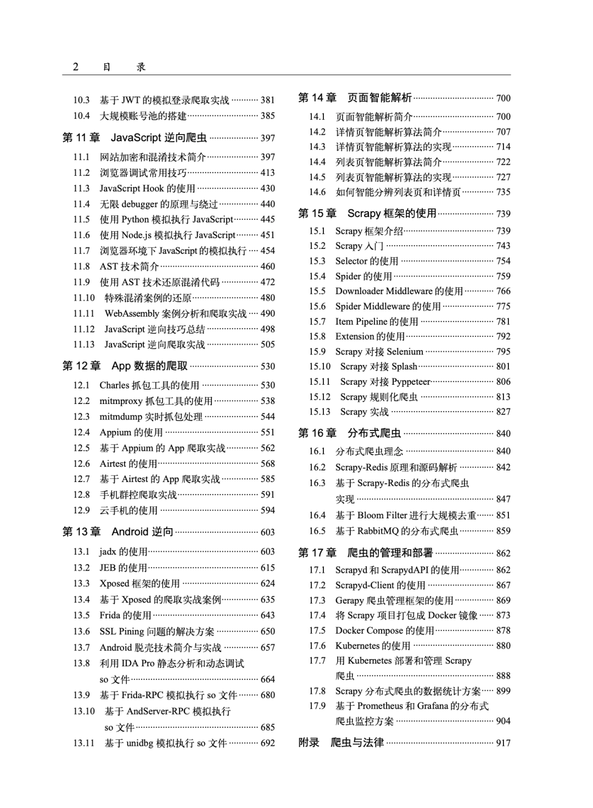

## 《Python3网络爬虫实战》第二版

## 目录结构（含阅读跳转链接）
- 第一章 爬虫基础
  - **1.1 HTTP基本原理**
  - **1.2 Web网页基础**
  - **1.3 爬虫的基本原理**
  - **1.4 Session 和 Cookie**
  - **1.5 代理的基本原理**
  - **1.6 多线程和多进程的基本原理**
- 第二章 基本库的使用
  - **2.1 urllib的使用**
  - **2.2 requests的使用**
  - **2.3 [正则表达式](https://cuiqingcai.com/202223.html)**
  - **2.4 httpx的使用**
  - **2.5 基础爬虫案例实战**
- 第三章 网页数据的解析
  - **3.1 [XPath 的使用](https://cuiqingcai.com/202231.html)**
  - **3.2 [Beautiful Soup 的使用](https://cuiqingcai.com/5548.html)**
  - **3.3 [PyQuery 的使用](https://cuiqingcai.com/5551.html)**
  - **3.4 [parsel 的使用](https://cuiqingcai.com/202232.html)**
- 第四章 数据的存储
  - **4.1 [TXT 文本文件存储](https://cuiqingcai.com/202241.html)**
    - 额外参考 ① [Python文件读写](https://www.yiibai.com/python/python_files_io.html)
  - **4.2 [JSON 文件存储](https://cuiqingcai.com/202242.html)**
  - **4.3 [CSV 文件存储](https://cuiqingcai.com/5571.html)**
  - **4.4 [MySQL 存储]**
  - **4.5 [MongoDB 存储]**
  - **4.6 [Redis 缓存存储](https://cuiqingcai.com/5587.html)**
  - **4.7 Elasticsearch搜索引擎存储**
  - **4.8 RabbitMQ的使用**
- 第五章 Ajax数据爬取
  - **5.1 什么是Ajax**
  - **5.2 Ajax分析方法**
  - **5.3 Ajax分析与爬取实战**
- 第六章 异步爬虫
  - **6.1 协程的基本原理**
  - **6.2 aiohttp的使用**
  - **6.3 aiohttp异步爬取实战**
- 第七章 JavaScript动态渲染页面爬取
  - **7.1 Selenium的使用**
  - **7.2 Splash的使用**
  - **7.3 Pyppeteer的使用**
  - **7.4 Playwright的使用**
  - **7.5 Selenium爬取实战**
  - **7.6 Pyppeteer爬取实战**
  - **7.7 CSS位置偏移反爬案例分析与爬取实战**
  - **7.8 字体反爬案例分析与爬取实战**
- 第八章 验证码的识别
- 第九章 代理的使用
  - **9.1 代理的设置**
  - **9.2 代理池的设置**
  - **9.3 付费代理的使用**
  - **9.4 ADSL拨号代理的搭建方法**
  - **9.5 代理反爬案例爬取实战**
- 第十章 模拟登陆
  - **10.1 模拟登录的基本原理**
  - **10.2 基于Session和Cookie的模拟登录爬取实战**
  - **10.3 基于JWT的模拟登录爬取实战**
  - **10.4 大规模账号池的搭建**
- 第十一章 JavaScript逆向爬虫
- 第十二章 App数据的爬取
- 第十三章 Android逆向
- 第十四章 页面智能解析
- 第十五章 Scrapy框架的使用
  - **15.1 Scrapy框架介绍**
  - **15.2 Scrapy入门**
  - **15.3 Selector的使用**
  - **15.4 Spider的使用**
  - **15.5 Downloader Middleware的使用**
  - **15.6 Spider Middleware的使用**
  - **15.7**
  - **15.8**
  - **15.9**
  - **15.10**
  - **15.11**
  - **15.12**
  - **15.13**
- 第十六章 分布式爬虫
- 第十七章 爬虫的管理和部署
## 目录结构参考

> 参考链接: [《Python3网络爬虫开发实战（第二版）》今天正式上市了！！！！](https://mp.weixin.qq.com/s/Z5LKuLxjYIRySfJ6zARTQA)

  

